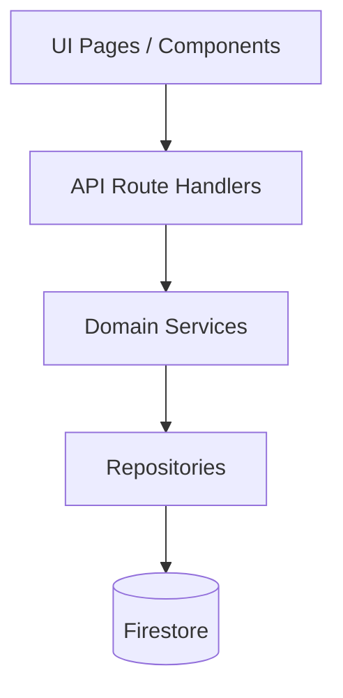
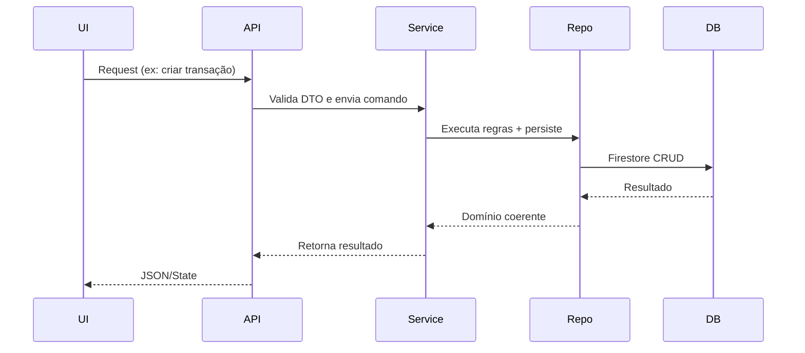
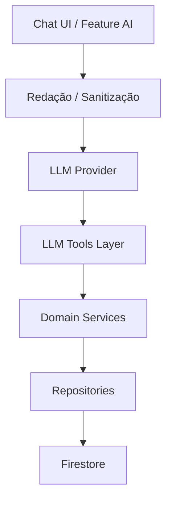

# Arquitetura do Sistema – Finance AI

Este documento descreve a arquitetura do **Finance AI**, uma plataforma moderna de controle financeiro pessoal com integração de **IA aplicada ao contexto financeiro**, capaz de realizar **classificação inteligente de gastos, planejamento com orçamento, análise agregada de fluxo de caixa, investimentos, pontos de fidelidade e insights automáticos com LLM**.

A arquitetura foi projetada com foco em:

- **Evolução independente de funcionalidades** (Feature-Oriented Architecture)
- **Domínio organizado e desacoplado** (Domain Isolation)
- **Código previsível e fácil de manter**
- **IA integrada com responsabilidade e segurança**
- **Server Components seguros (SSR Safe) – compatível com Next.js moderno**
- **Resiliência e extensibilidade de longo prazo**

---

## 🎯 Objetivo Arquitetural

Criar uma base **sólida e modular** para suportar crescimento de features sem perder controle sobre a organização do código nem sobre as regras de negócio — problemas comuns em sistemas financeiros. O projeto também busca demonstrar **arquitetura de software profissional** voltada para escalar tanto em **engenharia** quanto em **produto**.

---

## 🚀 Motivação

Sistemas financeiros normalmente degradam com o tempo:
❌ negócios acoplados a UI  
❌ lógica de domínio espalhada e duplicada  
❌ difícil introdução de IA com contexto e segurança  
❌ difícil testar e evoluir  

O **Finance AI** resolve isso com:

✅ **Domain Modules** – cada funcionalidade isolada  
✅ **Arquitetura “AI Ready”** – camada de IA integrada de forma determinística  
✅ **LLM Tools Layer** – IA que pode operar com dados do usuário com segurança  
✅ **Firestore Repository Pattern** – acesso a dados desacoplado  
✅ **Server-First Design** – rápido, seguro e econômico  

---

## ⚙️ Stack de Arquitetura

| Camada | Tecnologia |
|--------|------------|
| Runtime | Next.js 15 (App Router) + React 19 |
| Banco de Dados | Firebase Firestore |
| Autenticação | NextAuth (JWT) |
| Linguagem | TypeScript |
| Validação | Zod (runtime schemas) |
| UI | Tailwind + Shadcn |
| IA | Provider-agnostic LLM (OpenAI compatível) |
| Charts | Recharts |
| Deploy | Vercel (SSR Safe) ou Docker |

---

## 📐 Filosofia de Design

A arquitetura segue três princípios centrais:

### ✅ 1. Feature Layer Architecture
> Código organizado por contexto de negócio, não por tecnologia.

Isso significa que arquivos são agrupados por **função do sistema** (`accounts`, `transactions`, `budgets`), e não por tipo (`components`, `services`), aumentando a clareza e o encapsulamento.

---

### ✅ 2. Domain Isolation
> Cada área do domínio possui fronteiras explícitas e regras próprias.

Cada módulo tem:
- Tipos (`types`)
- DTOs (`dto`)
- Schemas (`schemas`)
- Repositórios (`repositories`)
- Serviços (`services`)
- API Handlers (`api`)

Nada de regra de negócio solta na UI ou na API. **Lógica é centralizada em domain services**.

---

### ✅ 3. SSR Safe
> Tudo funciona de forma segura em Server Components.

- Sem dependência de `window`, `document` ou hooks de client no domínio
- Sem dados fluindo para o client sem necessidade
- Preparado para Edge Runtime e caching granular

---

---

## 🧭 Decisões Arquiteturais Fundamentais

A arquitetura do Finance AI foi desenhada para evitar a deterioração comum em sistemas que crescem rápido. Por isso, várias decisões foram tomadas propositalmente para equilibrar **organização**, **escalabilidade** e **claridade técnica**.

---

### ✅ 2.1 Feature-Oriented Architecture (FOA)

Em vez do tradicional **MVC** ou separação rígida por pastas técnicas (`controllers/`, `utils/`, `models/`), adotamos **Feature Layer Architecture**, onde cada módulo é organizado por **contexto funcional**:

```ascii
src/domain/
    |
    ├── accounts/
    ├── transactions/
    ├── budgets/
    ├── ai/
    ├── investments/
    └── points/
```

✅ Benefícios:
- Baixo acoplamento
- Escalabilidade modular
- Evolução por domínio (microfrontends/microservices prontos no futuro)

---

### ✅ 2.2 Domain Isolation + Boundary Control

Regra: **nenhum domínio acessa internals de outro diretamente**. Toda comunicação entre domínios acontece via **services públicos** e **contratos estáveis**.

```ts
// ✅ Correto – comunicação através do serviço público
transactionService.create({...})

// ❌ Errado – acoplamento interno
import { internalRepository } from '../transactions/repositories'

---

✅ 2.3 SSR Safe by Design (Next.js)

O projeto é 100% SSR Safe, evitando dependência de browser APIs no domínio, permitindo uso em Server Components sem problema.

| Permitido                                    | Proibido                                            |
| -------------------------------------------- | --------------------------------------------------- |
| Serviços de domínio, validação, repositórios | `window`, `document`, hooks React dentro do domínio |
| Server Actions chamando services             | Código client-side misturado com regras             |
| Models/DTO/Zod no server                     | `useState` dentro de domain services                |

---

✅ 2.4 Repository Pattern + Firestore Converter Layer

Para garantir desacoplamento entre domínio e banco (Firestore), usamos repositórios com Data Converters:

Service -> Repository -> Firestore Converter -> Firestore

✔️ Permite mudar a persistência futuramente
✔️ Evita .where() e .collection() espalhados
✔️ Garante segurança: só services acessam dados

---

✅ 2.5 Strict Validation Everywhere

Toda entrada passa por Zod Schemas:

- API inputs ✅
- Forms ✅
- Webhook/LLM output ✅
- Domain services ✅

Isso evita corrupção de dados com disciplina arquitetural.

---

✅ 2.6 Separation: UI ↔ Domain

UI apenas orquestra, domínio decide.
Por exemplo, componentes nunca calculam parcelas; isso é regra de domínio:

```
// ✅ Correto: UI delega para domínio
const statement = await statementService.generateForAccount(accountId)

// ❌ Errado: cálculo de fatura dentro de componente React
```

---

✅ 2.7 AI as a Safe Layer (LLM Governance)

A IA não tem permissão para acessar dados diretamente. Sempre passa por Tools seguras e redação de privacidade, garantindo:

- Nenhum dado sensível é enviado ao modelo
- IA sempre via "função autorizada"
- Comportamento previsível e seguro

---

✅ 2.8 Evolução de Arquitetura sem Reescrever Código

Projeto já preparado para:

| Evolução futura            | Status                           |
| -------------------------- | -------------------------------- |
| Microservices?             | ✅ possível por domínio           |
| Multitenancy?              | ✅ preparado via userId isolation |
| Caching global?            | ✅ plugável                       |
| Analytics + ML?            | ✅ budget.engine + insights ready |
| IA avançada (tools + RAG)? | ✅ já embutido                    |

---

## 🗂️ Organização do Código – Domain Modules

O Finance AI é organizado em **módulos de domínio independentes**, cada um encapsulando toda sua lógica de negócio. Isso evita que regras se dispersem pelo projeto e mantém a evolução previsível e sustentável.

---

### ✅ Estrutura Geral

```ascii
src/
    |
    └── domain
        |
        ├── accounts/ ← módulo de contas
        ├── transactions/ ← módulo de transações
        ├── budgets/ ← módulo de orçamento
        ├── ai/ ← módulo de inteligência artificial
        ├── investments/ ← módulo de investimentos
        └── points/ ← módulo de pontos
```

Cada módulo contém:

```ascii
<module>/
    |
    ├── dto/ → DTOs de entrada/saída
    ├── schemas/ → validações e coerência (Zod)
    ├── types/ → tipos/contratos do domínio
    ├── repositories/ → acesso a Firestore (Repository Pattern)
    ├── services/ → regras de negócio (Use Cases)
    ├── api/ → adaptadores HTTP (chamados pelas rotas)
    └── index.ts → barrel de export
```

---

### ✅ Exemplo real – Módulo `transactions`

```ascii
src/domain/transactions/
    |
    ├── dto/
        └──  transaction.dto.ts
    ├── schemas/
        └──  transaction.schema.ts
    ├── types/
        └── transaction.ts
    ├── repositories/
        └── transaction.repository.ts
    ├── services/
        ├── transaction.service.ts
        ├── installment.engine.ts ← cálculo de parcelas
        └── statement.engine.ts ← fechamento de fatura
    └── api/
        └── handlers.ts ← usado pelas rotas /api/transactions
```


---

### ✅ Regras de Dependência (import policy)

As dependências seguem a regra de fluxo controlado:



✅ Permitido:

- UI → Service ✅
- Service → Repository ✅
- Repository → Firestore ✅

❌ Proibido:

- UI → Repository
- Service ↔ Service circular
- Services → UI (nunca)

---

✅ Boundary Map (Contextos)

Cada módulo tem fronteira clara:

| Módulo         | Responsabilidade                          |
| -------------- | ----------------------------------------- |
| `accounts`     | Gestão de contas e carteiras              |
| `transactions` | Transações, parcelamento, faturas         |
| `budgets`      | Metas e controle de orçamento             |
| `investments`  | Controle básico de posição e proventos    |
| `points`       | Programas de pontos e fidelidade          |
| `ai`           | Classificação de gastos e insights com IA |

Cada domínio pode evoluir de forma independente sem quebrar o restante do sistema.

---

✅ Server-Side First

Todos os Domain Services são SSR-Safe:

- Sem useState, window, document
- Sem side effects ou store global compartilhado
- Sem dependência de ambiente React

✅ Server Actions Ready

Os serviços podem ser chamados assim:

```typescript
    // app/(dashboard)/transactions/page.tsx
    import { transactionService } from '@/domain/transactions/services/transaction.service';

    export async function Page() {
    const txs = await transactionService.listByMonth(user.id, '2025-03');
    return <TransactionTable data={txs} />;
    }
```

---

## 🔄 Fluxos do Sistema

Esta seção mostra como os dados fluem dentro da arquitetura, desde uma requisição comum até uma operação de IA. O objetivo não é apenas mostrar a sequência técnica, mas **como garantimos previsibilidade e segurança na execução do sistema**.

---

### ✅ 4.1 Fluxo de Requisição (Request Flow)

Toda requisição HTTP ou Server Action segue este roteiro:



Regras do fluxo:
✅ Nenhuma lógica de negócio na UI
✅ Nenhuma regra dentro da rota API
✅ Apenas Services decidem comportamento do sistema
✅ Toda entrada é validada com Zod antes de virar domínio

---

✅ 4.2 Fluxo de Parcelamento de Compra

Aplicado em compras com cartão parcelado:

```ascii
User → cria transação (R$ 1.200, 12x no cartão)

transactionService.create()
   │
   ├── validate input via Zod
   ├── identifica tipo (parcelado)
   ├── chama installment.engine
   ├── gera 12 parcelas
   ├── vincula cada parcela à fatura correta
   └── salva no Firestore via repository
```

Regra importante: parcelas são entidades derivadas, não entradas do usuário. Usuário declara intenção, sistema operacionaliza.

---

✅ 4.3 Fluxo de Fechamento de Fatura (Cartão de Crédito)

```ascii
statementService.generateForAccount(accountId, month)
   │
   ├── busca todas as parcelas no período
   ├── aplica ajustes (estornos, juros, IOF)
   ├── considera faturas anteriores em atraso
   ├── calcula total a pagar
   └── devolve Statement (fatura) consistente
```

Este fluxo é determinístico (mesma entrada = mesmo resultado), ideal pra IA interpretar futuramente.

---

✅ 4.4 Fluxo de Orçamento Mensal (Budget)

```ascii
budgetEngine.compute(userId, month)
   │
   ├── consolida despesas por categoria
   ├── compara com limites definidos
   ├── calcula % utilizado
   ├── detecta estouros (>100%)
   └── expõe "alerts" para UI/IA
```

Este motor é usado tanto na UI quanto pela IA para construir compreensão financeira.

---

✅ 4.5 Fluxo da IA (LLM Tools)

Toda chamada de IA segue governança forte:

```mermaid
flowchart LR
    UserQuery[Usuário pergunta<br>"Quanto gastei no cartão?"] --> ChatLayer
    ChatLayer --> Sanitizer[Redação de privacidade<br>remove dados sensíveis]
    Sanitizer --> LLM
    LLM -->|function_call| ToolLayer[LLM Tools]
    ToolLayer --> DomainServices
    DomainServices --> ToolLayer --> LLM --> ChatLayer --> User
```

🔐 Garantias:

- IA não acessa Firestore diretamente
- IA só chama Tools autorizadas
- Uso de Zod para validar a resposta do modelo
- Logs nunca guardam dados sensíveis

---

```ascii
[Input do usuário] 
    ↓ (validação Zod)
[Domain Service]
    ↓ (controle por userId)
[Repository]
    ↓ (regra de Firestore Rules)
[Firestore]
```

Cada camada bloqueia comportamento inválido:
✅ validação de dados
✅ isolamento por usuário (multi-tenant seguro)
✅ regras de auth no banco

---

---

## 🤖 Arquitetura de IA – LLM Integration & Safety

A Inteligência Artificial não é tratada como um “acessório” no Finance AI — ela é um **componente arquitetural integrado**, projetada com **segurança**, **explicabilidade** e **controle**. O objetivo é permitir **insights financeiros confiáveis** e **operações assistidas** sem risco de vazamento de dados ou alucinações perigosas.

---

### 🎯 Objetivos da camada de IA

| Objetivo | Como é feito |
|----------|--------------|
| Segurança no acesso aos dados | IA nunca toca Firestore diretamente |
| Controle de execução | Toda ação via **LLM Tools** (Funções autorizadas) |
| Privacidade | Sanitização e anonimização antes do envio |
| Determinismo | Regras de negócio centralizadas em Domain Services |
| Observabilidade | Monitoramento de custo, tokens e ferramentas usadas |

---

### 🧱 Arquitetura de IA – Visão



---

## 🔧 LLM Tools Layer

# As Tools são funções seguras que o LLM pode chamar para obter informações do domínio:

Exemplo real:

```typescript
// tools/spend-per-category.ts
export const getSpendByCategoryTool = {
  name: "get_spend_by_category",
  description: "Retorna gastos do mês agrupados por categoria",
  parameters: z.object({ month: z.string() }),
  execute: async ({ month }, userId) => {
    return budgetEngine.compute(userId, month);
  }
};
```

---

## 🔐 Segurança – Anti Vazamento

# Antes de enviar qualquer dado para IA, passamos por sanitização obrigatória:

```typescript
sanitizeForLLM([
  { description: "PIX MARIA JOSE SILVA", amount: 9500 }
])
// => "PIX contato_1 ****"
```

✅ Nomes e descrições sensíveis são mascarados
✅ Merchant raro vira genérico
✅ Nunca enviamos userId, email ou IDs internos

---

## 🧠 Pipeline de Classificação de Gastos (AI + Regras)

```ascii
transaction.created
    ↓
rulesEngine.match()         ← tenta classificar localmente (regex, merchants conhecidos)
    ↓
fallback → llm.classify()   ← IA sugere categoria e tags
    ↓
reviewQueue.append()        ← humano revisa quando confiança < limite
```

---

## ⚙️ Exemplo de uso seguro de IA no domínio

```typescript
const result = await aiService.classifyTransaction({
  description: "Uber Trip",
  amount: 28.90
});

// result =>
// { category: "transporte", confidence: 0.92 }
```

✔️ Nenhuma chamada direta ao modelo no front
✔️ Sem JSON arbitrário vindo do modelo — sempre validado com Zod

---

## ✅ Governança sobre IA

| Risco                | Mitigação                                           |
| -------------------- | --------------------------------------------------- |
| Alucinação de dados  | Tools determinísticas e validação                   |
| Exfiltração de dados | Sanitização + LLM Safe Layer                        |
| Cost overrun         | Limites por usuário + monitor de tokens             |
| Privacidade          | Redação obrigatória antes de enviar dados a modelos |
| Prompt Injection     | Filtros + validação de schema                       |

---

## 🧭 Boas Práticas e Convenções de Arquitetura

Para manter o projeto escalável, colaborativo e fácil de evoluir, foram definidas regras claras para organização de código, naming, dependências e evolução arquitetural.

---

### ✅ 6.1 Regras de Dependência

1. UI nunca acessa o banco direto — **apenas Domain Services**
2. Nenhum domínio acessa outro diretamente sem contrato
3. Domain Services não conhecem tecnologia — só lógica
4. Repositories não acessam outros repositórios
5. Nada no domínio depende de componentes React ⚠️

```ascii
🚫 Proibido:
UI → Repository
Repository → Service
Service → UI
```

## ✅ 6.2 Naming Conventions

| Tipo                      | Regra             |
| ------------------------- | ----------------- |
| Domain Service            | `*.service.ts`    |
| Repository                | `*.repository.ts` |
| DTO                       | `*.dto.ts`        |
| Domain Schema             | `*.schema.ts`     |
| Engine (regras complexas) | `*.engine.ts`     |
| Tools IA                  | `*.tool.ts`       |
| Firestore mappers         | `*.converter.ts`  |

---

## ✅ 6.3 Domain Services – Padrão

Todo service segue casos de uso (Use Cases) claros:

```typescript
// ✅ Bom
transactionService.create()
transactionService.listByAccount()
transactionService.closeInstallments()

// 🚫 Ruim
transactionService.helper()
transactionService.doStuff()
```

---

## ✅ 6.4 Como Criar um Novo Módulo de Domínio

Passos obrigatórios:

1- Criar pasta em src/domain/<new-module>
2- Criar:
    - /dto para contratos externos
    - /schemas validação com Zod
    - /services regras de uso
    - /repositories persistência
3- Criar index.ts exportando API pública
4- Adicionar testes unitários para engines críticas
5- Registrar Tools IA (se necessário)

---

## ✅ 6.5 Firestore – Regras de Arquitetura

✔️ Sempre passar userId para cada query
✔️ Nunca usar .collection('x') diretamente na UI
✔️ Não retornar dados sem validação com Zod
✔️ Garantir segurança com Firestore Rules

---

## ✅ 6.6 Feature Flags & Evolução Incremental

O projeto suporta evolução com feature flags em banco ou runtime:

```typescript
if (featureFlags.points) {
  // ativa módulo de pontos
}
```

Permite crescimento sem branches infinitos.

---

## ✅ 6.7 Padronização de Erros

Todas as exceções seguem uma DomainError:

```typescript
throw new DomainError("Invalid operation", { code: "TX_INVALID", context });
```

Resultado: debug rápido e previsível.

---

## ✅ 6.8 Documentação Arquitetural Contínua (ADR)

Toda decisão relevante deve ser registrada em /docs/adr/YYYY-MM-DD-title.md.

Modelo simples:

```typescript
# Decisão: Criar módulo AI como domínio próprio
Status: Aceita
Contexto: IA precisa de isolamento e governança
Decisão: AI se torna domain layer com Tools
Consequência: Módulo seguro, independente, rastreável
```

---

## ✅ Conclusão

A arquitetura do Finance AI foi projetada com foco em **clareza, escalabilidade e robustez técnica**.  
A organização por **domínios isolados** permite crescimento sem bagunça.  
O uso de **SSR Safe** garante performance e segurança no Next.js moderno.  
E a camada de **IA com Tools governadas** prova que é possível integrar LLM com responsabilidade e engenharia de verdade.

Este projeto demonstra:
✅ Engenharia de software moderna  
✅ Organização baseada em domínio (Domain Modules)  
✅ Clean Architecture aplicada na prática  
✅ IA aplicada com contexto real de negócio  
✅ Segurança e isolamento por design  
✅ Prontidão para evolução futura (microservices / caching / analytics)

---

## 🎯 Roadmap Arquitetural (Futuro)

| Fase | Evolução |
|------|----------|
| ✅ Atual | Domain Modules + AI Tools + SSR Safe |
| 🔜 Próxima | Background Jobs (cron/queues), caching com Redis |
| 🔜 Futura | Observabilidade (logs de domínio + AI metrics) |
| 🔜 Escala | Microservices por domínio ou modular monolith |
| 🔜 IA+ | RAG com embeddings + Personal Finance Memory |

---

## 🧩 Resumo Técnico (para Recrutadores)

> O projeto aplica arquitetura modular por domínio (Feature Layer Architecture) usando Next.js 15 com SSR Safe, Firestore como banco, e integração de IA através de um LLM Tools Layer seguro.  
>
> Todo acesso a dados passa pela camada de domínio (Repository Pattern), e a IA opera com **sanitização, validação com Zod e outils determinísticas**.  
>
> A modularização favorece escalar features sem criar dívida técnica, mantendo uma base limpamente estruturada e preparada para crescer.

---

## 📎 Anexos Arquiteturais (Futuro)

- 📚 Regras de Dependência – `docs/architecture/DEPENDENCY-GUIDE.md`
- 💾 Modelo Firestore – `docs/database/FIRESTORE-MODEL.md`
- 🧪 Test Strategy – `docs/tests/TEST-STRATEGY.md`
- 🤖 AI Governance – `docs/ai/AI-GUIDE.md`

---
